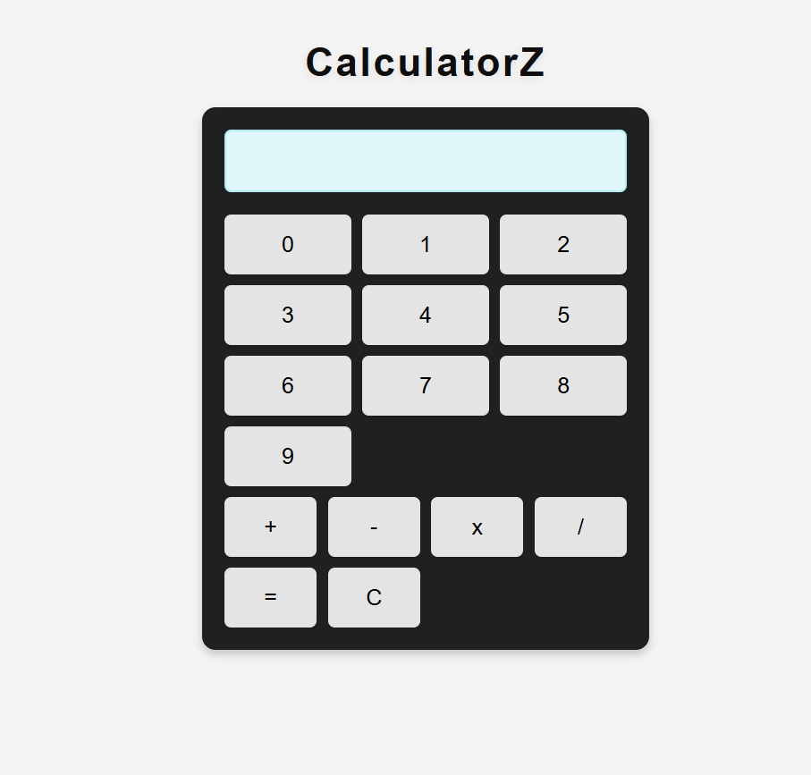

# Calculator App

A simple calculator application built using HTML, CSS, and JavaScript.

## Screenshot

 

## Description

This project is a basic calculator that performs addition, subtraction, multiplication, and division. It features a user-friendly interface and displays the current expression as well as the final result.
